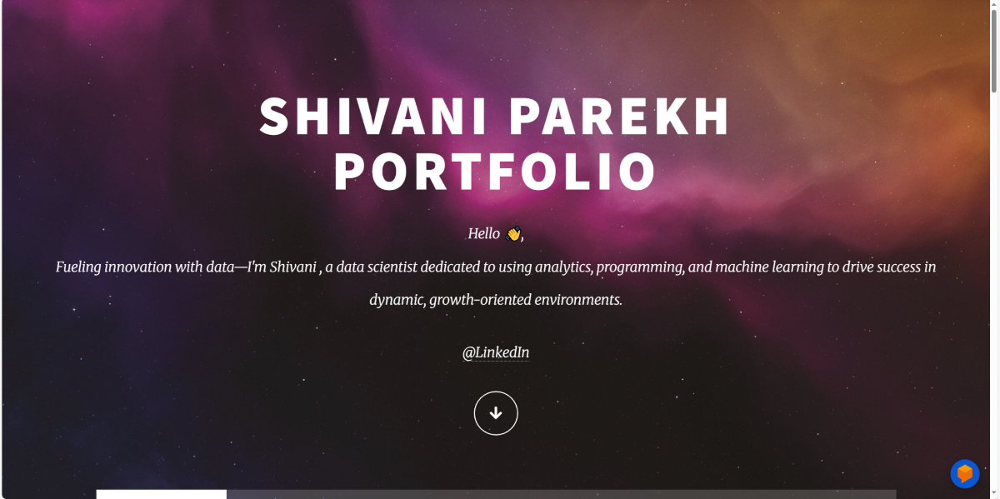

# ✨ Shivani Parekh Portfolio

Welcome to my **personal portfolio!**  
This website showcases my **projects**, **skills**, and **experience** as a **Data Scientist**.  
It’s built using **HTML**, **CSS**, and **JavaScript**, and hosted with **GitHub Pages** to serve as a central hub for everything I create.

🌐 **Live Demo:** [https://shivaniparekh.github.io/shivaani-portfolio/](https://shivaniparekh.github.io/shivaani-portfolio/)

---

## 📂 Features

- 🧭 **Clean and responsive design** — optimized for desktop. 
- 💼 **Projects showcase** — includes data visualizations, dashboards, and ML models  
- 🧑‍💻 **About Me section** — highlights my skills, background, and interests  
- 📬 **Contact links** — easy access to email and social profiles 
- ⚡ **Smooth animations** — subtle fade-ins, slides, and hover effects for a modern feel

---

## 🖼️ Preview

  

---

## 🧠 Future Improvements

- [ ] ✍️ Add a **blog section** to share data science insights and tutorials.
- [ ] 🎞️ Improve **animations and transitions** with JavaScript.

---

## 📫 Contact

Feel free to connect with me!  

- 🌐 **Website:** [https://shivaniparekh.github.io/shivaani-portfolio/](https://shivaniparekh.github.io/shivaani-portfolio/)  
- ✉️ **Email:** [parekh.shivani21@gmail.com](mailto:parekh.shivani21@gmail.com)  
- 💼 **LinkedIn:** [https://www.linkedin.com/in/shivani-parekh-/](https://www.linkedin.com/in/shivani-parekh-/)  
- 💻 **GitHub:** [https://github.com/ShivaniParekh](https://github.com/ShivaniParekh)

---

## 💖 Support

⭐️ If you like this project, please consider giving it a **star** on GitHub!  
Your support helps others discover my work and motivates me to keep creating.

  

---
